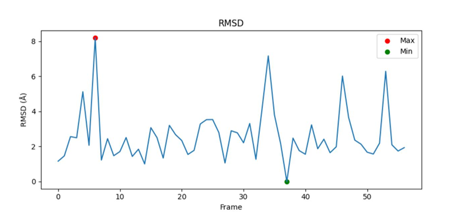
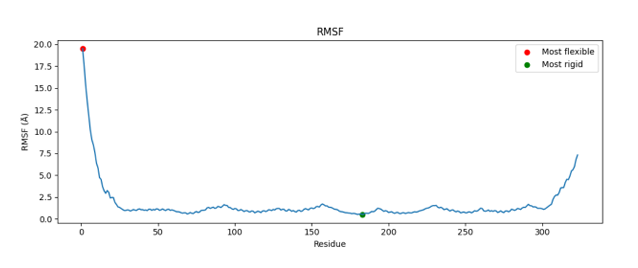
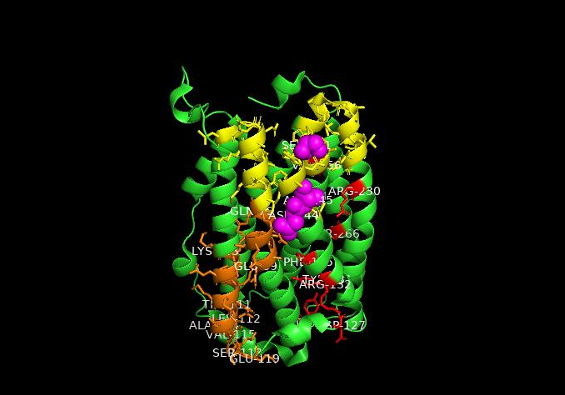
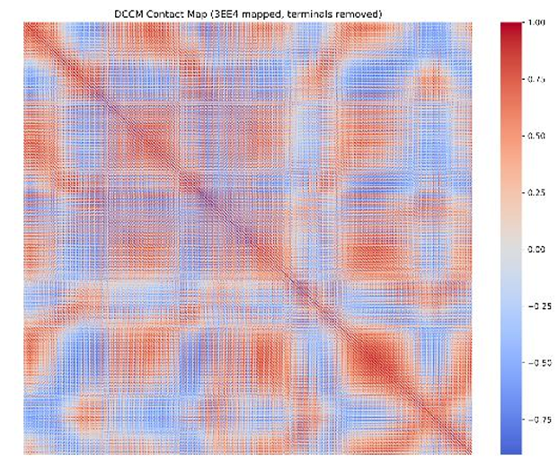
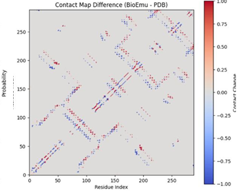
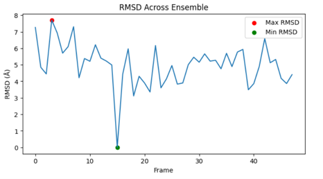
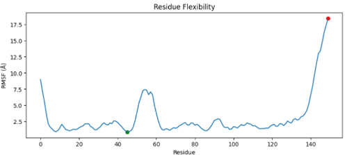

# Bioemu
# Decoding the Conformational Landscape of Class Ib Ribonucleotide Reductase

**Ensemble Modelling of Radical Transfer, Allosteric Communication, and Dynamic Regulation Using BioEmu**

> M.Sc. Bioinformatics Thesis — Central University of South Bihar, Gaya, in collaboration with the Bioinformatics Centre, SPPU & NCCS, Pune
> **Author:** Bushra Rahman · **Supervisor:** Dr Shekhar C. Mande, Distinguished Professor, SPPU

<!-- Optional badges — add your own once the repo is live


-->

---

## Overview

Ribonucleotide reductase (RNR) is the **only enzyme capable of converting ribonucleotides into deoxyribonucleotides**, making it essential for DNA replication and repair across all life. Its Class Ib variant, built from the catalytic **NrdE**, radical-generating **NrdF**, and accessory flavoprotein **NrdI** subunits, relies on a long-range, oxygen-dependent radical relay mechanism that has been extremely difficult to capture using static structural techniques like X-ray crystallography alone.

This project uses **BioEmu-1**, a generative diffusion model from Microsoft Research trained on 200+ milliseconds of molecular dynamics data, to generate **thermodynamically grounded conformational ensembles** for three mycobacterial Class I/Ib RNR components, and analyses them using RMSD/RMSF profiling, dynamical cross-correlation matrices (DCCM), and residue interaction network centrality, revealing how these proteins move, communicate, and self-regulate at a level invisible to single static structures.

| System | Organism | PDB ID | Role |
|---|---|---|---|
| **NrdB** | *Mycobacterium tuberculosis* | 3EE4 | Class Ia radical-harbouring (R2-type) subunit |
| **NrdI** | *Mycobacterium thermoresistibile* | 8J4V | Class Ib flavoprotein radical-assembly mediator |
| **NrdF2:NrdI complex** | *Mycobacterium tuberculosis* | 8J4X | Class Ib catalytic–accessory subunit assembly |

---

## Key Findings of the study

- **A conserved dual dynamic architecture** — a rigid catalytic core flanked by discrete flexible "hotspot" regions was found across all three systems, despite representing two different RNR classes.
- **The 50s-loop (residues 48–63) of NrdI is the primary dynamic regulatory switch**, consistent with its proposed role in redox-coupled oxygen-tunnel gating, and this behavior reproduced independently in both the isolated NrdI (8J4V) and the NrdF2:NrdI complex (8J4X).
- **PRO47 and residue 54 form a structural communication bridge** in NrdI, linking the rigid FMN-binding platform to the mobile 50s-loop.
- **NrdF2 maintains a stable catalytic core** with two localized communication hub clusters (residues 88–98 and 208–214) positioned near the di-manganese metal-binding ligands, suggesting a second-shell allosteric relay.
- **BioEmu ensembles preserved native contact topology** (1,970 of 2,792 crystal contacts retained for NrdB) while still sampling biologically meaningful expanded/transient states, validating the generative approach as a low-cost alternative to conventional MD for this enzyme class.
- The complex shows a clear **division of labour**: NrdI acts as the conformationally adaptive redox sensor/gate, while NrdF2 provides the structurally persistent scaffold required for radical chemistry.

---

## Background

RNR occupies an irreplaceable metabolic niche , no alternative biosynthetic route exists for deoxyribonucleotide production,and it is a validated target for anticancer and antiviral drugs. Class Ib RNRs are of particular interest because they use **molecular oxygen** (rather than iron, as in Class Ia) to generate their catalytic tyrosyl radical, via a superoxide-mediated mechanism at the NrdF di-manganese centre that depends on the accessory flavoprotein NrdI.

Because catalysis in RNR is deeply coupled to conformational change, the C-terminal tail motion, metal-centre rearrangement, and long-range proton-coupled electron transfer (PCET) over 35+ Å, provides a purely static structural picture cannot explain how radical transfer, allosteric regulation, and catalytic gating actually occur. This project attempts to addresses that gap computationally.

---

## Methodology

1. **Ensemble Generation** — Conformational ensembles for each system were generated using **BioEmu-1**, with side-chain reconstruction performed via **HPacker**.
2. **Trajectory Processing** — Cα-only trajectories were parsed with **MDAnalysis**; residues were re-indexed continuously; all frames were aligned to the **medoid** (minimum summed pairwise RMSD) reference structure to remove global rigid-body motion.
3. **Structural Stability (RMSD)** — Per-frame backbone RMSD relative to the medoid was used to assess global ensemble stability and identify transiently expanded states.
4. **Residue Flexibility (RMSF)** — Per-residue Cα fluctuation, z-score normalized, used to flag flexibility hotspots (z ≥ 1.0) and strong hotspots (z ≥ 1.5).
5. **Correlated Motion (DCCM)** — Dynamical cross-correlation matrices quantified coupled/anti-coupled residue motions across the fold.
6. **Residue Interaction Networks** — Graphs built from DCCM pairs (|r| > 0.35, sequence separation > 2) using **NetworkX**; nodes ranked by **degree centrality** and **betweenness centrality**.
7. **Hub & Conformational Switch Identification** — A composite hub score (0.65 × degree + 0.35 × betweenness) flagged the top 15% most central residues; residues that were *both* highly flexible and highly central were classified as candidate **conformational switch residues**.
8. **Validation** — Contact-map comparison against the experimental crystal structures, reproducibility checks across trajectory subsets and correlation thresholds, and cross-validation against literature.</br></br>

*Full software/tool versions and databases used are listed below*

| Tool/Package | Version | Purpose | Reference / URL |
|---|---|---|---|
| **BioEmu-1**| *v1.0* | Conformational ensemble generation | Lewis et al., 2026 / GitHub |
| **MDAnalysis** | *2.7.0* |  MD trajectory parsing and analysis | Michaud-Agrawal et al., 2011 |
| **NetworkX** | *3.3* | Graph construction and centrality analysis | Hagberg et al., 2008 |
| **NumPy** | *1.26* |  Numerical computation | Harris et al., 2020 |
| **Matplotlib** | *3.8* | Data visualisation and plotting | Hunter, 2007 |
| **HPacker** | *--* | Side-chain reconstruction from BioEmu ensembles | BioEmu pipeline |
| **PyMOL** | *2.5* |  Molecular structure visualisation | Schrödinger LLC |
| **Python** | *3.10* | Primary scripting language | python.org |

---

## Results

### 1. NrdB — Class Ia Radical-Harbouring Subunit (PDB: 3EE4)

- Mean ensemble RMSD: **2.59 Å** (max 8.19 Å at frame 6) - the ensemble stayed close to the native fold while still sampling transient expanded conformers.
- Most rigid residue: **183** (RMSF 0.52 Å) - anchoring the metal-binding core.
- Two internal flexibility hotspots: **residues 75–89** and **142–155**.
- Strongest correlated motion: residues **211–232** (r = 0.97); strongest anti-correlation: residues **134–166** (r = −0.88).
- Communication hubs concentrated in **residues 103–151**, overlapping with the flexible hinge regions.
- Contact-map validation: **1,970 contacts preserved**, 822 lost, 73 gained relative to the crystal structure, confirming native topology was maintained.

## Backbone RMSD Analysis

<p align="center">
  
</p>

<p align="center">
<i><b>Figure 1.</b> Backbone RMSD of the BioEmu-generated NrdB ensemble relative to the medoid structure, illustrating the overall structural stability and conformational variation sampled across the ensemble.</i>
</p>
## Residue Flexibility (RMSF)

<p align="center">
  
</p>

<p align="center">
<i><b>Figure 2.</b> Per-residue RMSF profile of the NrdB ensemble. Peaks correspond to flexible regions, while low RMSF values indicate structurally stable segments within the protein.</i>
</p>


<p align="center">
  
</p>

<p align="center">
<i>Figure 3. Structural visualization of NrdB (PDB: 3EE4) showing communication hub residues, flexibility hotspots, and the metal-binding core.</i>
</p>
## Dynamical Cross-Correlation Matrix (DCCM)

<p align="center">
  
</p>

<p align="center">
<i><b>Figure 3.</b> Dynamical cross-correlation matrix of the NrdB ensemble. Positive correlations indicate concerted residue motions, whereas negative correlations represent anti-correlated movements, revealing long-range dynamic communication within the protein.</i>
</p>
## Contact Map Validation

<p align="center">
  
</p>

<p align="center">
<i><b>Figure 5.</b> BioEmu contact probability map and contact-difference map compared with the experimental crystal structure, demonstrating preservation of native residue contacts while sampling biologically relevant conformational states.</i>
</p>

---

### 2. NrdI — Class Ib Flavoprotein Redox Mediator (PDB: 8J4V)

- Mean ensemble RMSD: **~4.98 Å** - higher global variability than NrdB, consistent with NrdI's more dynamic redox-mediator role, but this was driven almost entirely by disordered termini rather than the FMN-binding core.
- Dominant internal flexibility hotspot: the **50s-loop (residues 51–61)**, peaking at **THR55**.
- FMN-contact residues (THR48, TYR49, GLY50, GLY51) were comparatively rigid, forming a stable cofactor-positioning scaffold.
- Strongest correlated motion: residues **43–82** (r = 0.958); strongest anti-correlation: residues **33–113** (r = −0.59).
- Top communication hubs: **PHE9** (highest overall), **PRO47** and **THR55** (core junction/loop bridge), **VAL68**, **ARG114**.

> <p align="center">
  
</p>

<p align="center">
<i><b>Figure 1.</b> Backbone RMSD of the BioEmu-generated NrdI ensemble relative to the medoid structure, illustrating the overall structural stability and conformational variation sampled across the ensemble.</i>
</p>

## Residue Flexibility (RMSF)

<p align="center">
  
</p>

<p align="center">
<i><b>Figure 2.</b> Per-residue RMSF profile of the NrdB ensemble. Peaks correspond to flexible regions, while low RMSF values indicate structurally stable segments within the protein.</i>
</p>


> 🖼️ **[Insert Figure: NrdI structural visualisation showing the bipartite rigid-scaffold / mobile-loop organisation]**
> 🖼️ **[Insert Figure: NrdI DCCM heatmap and network analysis]**

---

### 3. NrdF2:NrdI Complex — Class Ib Catalytic Assembly (PDB: 8J4X)

**NrdF2 subunit:**
- Core (post-terminal-exclusion) flexibility hotspots: **residues 31–35**, **88–98**, and **210–218**, all in the moderate 4.0–4.2 Å range — a much narrower conformational envelope than NrdI's loop motion, consistent with NrdF2's need to preserve precise di-manganese coordination geometry.
- Two principal communication hub clusters: **residues 208–214** (peak at residue 210, hub score 0.461) and **residues 88–98** — both positioned near, but distinct from, the Mn-coordinating ligands (Glu103, His106, His200, Glu197), suggesting a second-shell allosteric relay.
- Strongest correlated motion: residues **88–207** (r = 0.970); strongest anti-correlations: **55–216** (r = −0.796) and **125–272** (r = −0.791).

**NrdI subunit (within the complex):**
- The **50s-loop (residues 48–58)** again emerged as the dominant flexibility hotspot (peak at GLY51, GLY50) — independently reproducing the finding from the isolated 8J4V structure.
- Top communication hub: **residue 54** (betweenness centrality 0.1468), followed by residues 75, 95, 92, and 31 — residue 95 sits proximal to the interfacial **Glu97–Arg30** gating contact with NrdF2.

> 🖼️ **[Insert Figure: NrdF2 RMSD across the ensemble]**
> 🖼️ **[Insert Figure: NrdF2 per-residue RMSF profile]**
> 🖼️ **[Insert Figure: NrdF2 DCCM heatmap and network hub clusters]**
> 🖼️ **[Insert Figure: NrdI (within complex) RMSD across the ensemble]**
> 🖼️ **[Insert Figure: NrdI (within complex) per-residue RMSF profile]**
> 🖼️ **[Insert Figure: NrdI (within complex) DCCM heatmap and network analysis]**
> 🖼️ **[Insert Figure: Full NrdF2:NrdI complex structural overview with communication hubs, 50s-loop, and Glu97/Arg30 interfacial gating residues mapped]**

---

## Discussion — What It Means

- **BioEmu captures functionally relevant landscapes.** Across all three systems, ensembles reproduced a consistent "rigid core + flexible module" organisation that matches known enzymatic requirements, precise active-site geometry alongside the conformational give needed for catalysis, without being explicitly trained to do so for these specific proteins.
- **The 50s-loop is a conserved, intrinsic dynamic switch.** Its independent emergence as the top flexibility hotspot in two different NrdI structures (86% sequence identity, isolated vs. complexed) argues that this mobility is a sequence-encoded property of the protein, not a crystallographic or complex-specific artefact, supporting a **conformational selection** model for redox-coupled oxygen-tunnel gating.
- **PRO47 + residue 54 form a mechanistic "hinge-and-amplifier" unit** — PRO47's fixed backbone dihedral anchors the loop-scaffold junction, while residue 54 (inside the loop) distributes motion into the wider network, a testable hypothesis for future mutagenesis studies.
- **NrdF2 and NrdI show a clear division of labour**: NrdI is the conformationally adaptive redox sensor/gate; NrdF2 is the structurally persistent scaffold for radical chemistry, mirroring the biologically proposed roles of these two subunits.

---

## Repository Structure

<!-- Edit this to match your actual folder layout -->
```
.
├── data/                # Input structures / raw BioEmu ensembles
├── scripts/              # Analysis pipeline (RMSD, RMSF, DCCM, network analysis)
├── results/               # Output figures, tables, and processed ensembles
├── docs/
│   └── thesis.pdf         # Full thesis document
└── README.md
```

---

## Team

| Name | Role | Contact |
|------|------|---------|
| **Bushra Rahman** | Project (M.Sc. Bioinformatics, CUSB) | bushrar588@gmail.com |
| **Shekhar Mande, PhD** | Guide (Distinguished Professor, SPPU) | shekhar@nccs.res.in |

---

## Citation

If you use this work, please cite:

> Rahman, B. (2026). *Decoding the Conformational Landscape of Class Ib Ribonucleotide Reductase: Ensemble Modelling of Radical Transfer, Allosteric Communication, and Dynamic Regulation Using BioEmu.* M.Sc. Thesis, Department of Bioinformatics, Central University of South Bihar, Gaya, India. Supervised by Dr Shekhar C. Mande.

---

## Acknowledgements

This work was carried out under the supervision of **Dr Shekhar C. Mande**, Distinguished Professor, Bioinformatics Centre, SPPU, with support from the **Bioinformatics Centre, SPPU** and the **National Centre for Cell Sciences (NCCS), Pune**.

---

## 📄 License

<!-- Choose a license, e.g. MIT, and add a LICENSE file -->
This project is shared for academic and research purposes. Please contact the author for reuse permissions.

